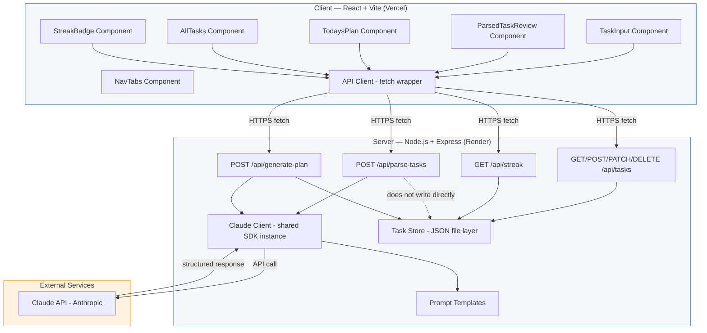
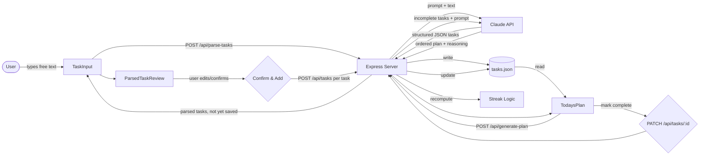
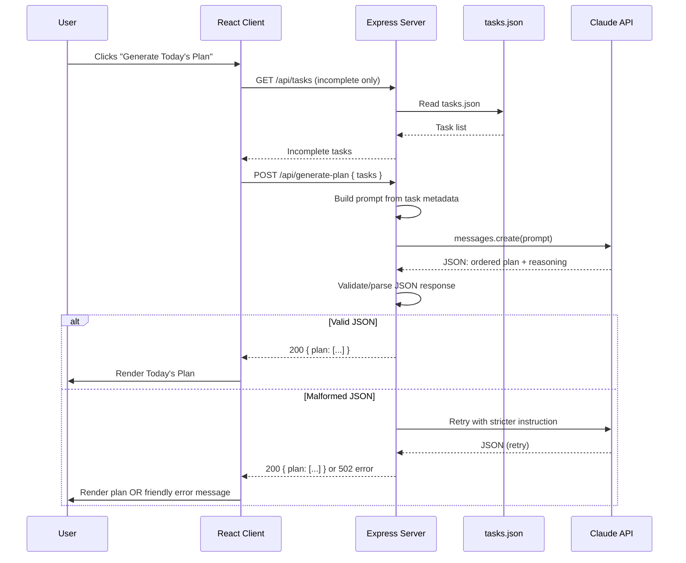

# ARCHITECTURE.md — FocusFlow System Architecture

**Project:** FocusFlow — AI-Powered Task Prioritization & Daily Planning
**Date:** Day 2 of 10 — System Design
**Status:** Approved for implementation (Days 3–10)

This document is the technical source of truth for how FocusFlow's pieces fit together. It builds directly on the approved PRD and Implementation Blueprint — no new features or scope introduced here, only the structure needed to build what was already agreed.

---

## 1. Tech Stack Summary

| Layer | Choice |
|---|---|
| Frontend | React + Vite |
| Backend | Node.js + Express |
| Storage | JSON-file-backed store (no database) |
| Auth | None (single-user, v1.0 scope) |
| AI | Claude API (Anthropic), server-side only |
| Hosting | Vercel (frontend) + Render (backend) |

---

## 2. Component Diagram

**Key architectural rule:** the Claude API key lives only in the server's environment variables. The client never talks to Claude directly — every AI interaction is proxied through Express. This satisfies the PRD's non-functional security requirement.

---

## 3. Data Flow

**Flow explanation (matches PRD Section 8 — User Flow):**
1. User types free text → sent to backend for parsing.
2. Backend calls Claude, returns structured (unsaved) tasks for review.
3. User confirms → each task is individually saved to `tasks.json` via the existing CRUD API.
4. Dashboard requests a plan → backend sends current incomplete tasks to Claude, returns an ordered plan with reasoning.
5. User marks tasks complete → backend updates storage and recalculates the streak.

---

## 4. Request Lifecycle (Example: Generating Today's Plan)

This lifecycle applies equally to `/api/parse-tasks`, with the same retry-once-then-fail-gracefully pattern, per the Blueprint's Day 4 debugging guidance.

---

## 5. AI Interaction Design

FocusFlow calls Claude for exactly two distinct purposes, each with its own prompt template (kept in `/server/lib/prompts.js`):

### 5.1 Task Parsing (`/api/parse-tasks`)
- **Input:** raw free-text string from the user.
- **Instruction to Claude:** extract discrete tasks; infer `category` (Work/Personal/Health/Errands/Other), `urgency` (High/Medium/Low), and `estimatedTime` (minutes) from context and deadline language; return **only** a valid JSON array, no prose.
- **Output contract:** `[{ title, category, urgency, estimatedTime }, ...]`
- **Failure handling:** strip markdown code fences if present → attempt `JSON.parse` → on failure, retry once with a stricter "respond with ONLY valid JSON" instruction → on second failure, return a 502 with a friendly client-facing error.

### 5.2 Daily Plan Generation (`/api/generate-plan`)
- **Input:** the current list of incomplete tasks (full metadata: title, category, urgency, estimatedTime).
- **Instruction to Claude:** return the same tasks reordered by priority, each with one short reasoning sentence explaining its place in the order.
- **Output contract:** `[{ taskId, order, reasoning }, ...]`
- **Failure handling:** same retry-then-fail-gracefully pattern as parsing. Empty task list is short-circuited before calling Claude at all (no API call needed for an empty plan).

Both routes share one `claudeClient.js` module (a single instantiated Anthropic SDK client) to avoid duplicating configuration.

---

## 6. External Services

| Service | Purpose | Notes |
|---|---|---|
| **Claude API (Anthropic)** | Task parsing + daily plan generation | Only external dependency. Called server-side only. API key stored as an environment variable on Render, never committed to git. |
| **Vercel** | Frontend hosting | Free tier. Auto-builds from the `client/` folder on push to `main`. |
| **Render** | Backend hosting | Free tier. Runs the Express server; environment variables (Claude API key, CORS origin) configured in the Render dashboard. |

No other external services are used in v1.0 — consistent with the PRD's explicit exclusion of calendar sync, notifications, and third-party auth providers.

---

## 7. Environment Variables

| Variable | Location | Purpose |
|---|---|---|
| `ANTHROPIC_API_KEY` | Server (`.env`, and Render dashboard in production) | Claude API authentication |
| `PORT` | Server | Express listen port (Render sets this automatically in production) |
| `CORS_ORIGIN` | Server | Restricts API access to the deployed frontend's exact URL |
| `VITE_API_BASE_URL` | Client (`.env.production`) | Points the frontend at the deployed backend URL |

---

## 8. Architectural Decisions Log (Day 2)

| Decision | Rationale | Conflicts with PRD/Blueprint? |
|---|---|---|
| JSON-file-backed storage (not in-memory) | Prevents data loss on server restart/redeploy, important for Day 10 demo reliability | No — resolves an intentional ambiguity in the Blueprint in the PRD's favor |
| Two separate prompt templates, one shared Claude client | Keeps parsing and planning logic independently testable and debuggable | No — matches Blueprint Days 4 and 6 exactly |
| No database, no auth | PRD explicitly scopes v1.0 as single-user with no accounts | No — directly enforces existing PRD scope |

No scope changes were introduced today. The Implementation Blueprint's Days 3–10 remain valid as written.