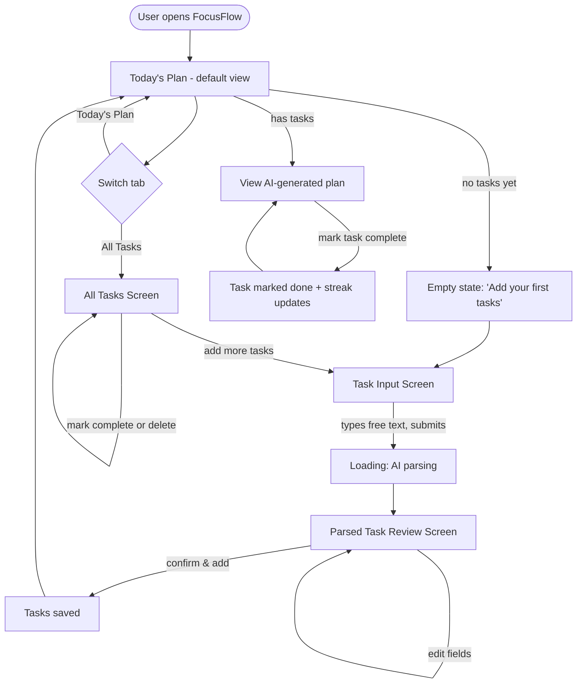

# UI-WIREFRAMES.md — FocusFlow User Flow & Screens

**Scope:** v1.0 only — two primary screens plus one shared input flow, per PRD Section 8 (User Flow). No screen exists without a direct link back to a PRD functional requirement.

---

## 1. User Flow Diagram



---

## 2. Screen Flow (v1.0 — exactly 3 screens + 1 shared component)

| Screen | Purpose (ties to PRD) | Default? |
|---|---|---|
| **Today's Plan** (Home) | FR-4: primary dashboard, shows AI-generated prioritized plan + streak | Yes — landing view |
| **Task Input** | FR-1: free-text entry point for new tasks | Reached via "Add Tasks" action |
| **Parsed Task Review** | FR-3: review/edit AI output before saving | Shown automatically after parsing |
| **All Tasks** | FR-5, FR-6: full task list, complete/delete any task | Reached via nav tab |

Every screen maps directly to a functional requirement — no screen was added "because it might be nice." This was checked explicitly against the PRD as part of today's Day 3 Readiness Check.

---

## 3. Low-Fidelity Wireframes

### 3.1 Today's Plan (Home / Default View)
```
┌─────────────────────────────────────────────────┐
│  FocusFlow          [Today's Plan] [All Tasks]   │  ← NavTabs
├─────────────────────────────────────────────────┤
│  🔥 4-day streak                                 │  ← StreakBadge
│                                                   │
│  Today's Plan                    [+ Add Tasks]   │
│  ┌─────────────────────────────────────────────┐ │
│  │ ☐ 1. Finish quarterly report        [Work]   │ │
│  │    "Hard deadline today — do this first."    │ │
│  ├─────────────────────────────────────────────┤ │
│  │ ☐ 2. Gym                          [Health]   │ │
│  │    "Quick energy boost before deep work."    │ │
│  ├─────────────────────────────────────────────┤ │
│  │ ☐ 3. Call mom                    [Personal]  │ │
│  │    "Low urgency — fits in a spare moment."   │ │
│  └─────────────────────────────────────────────┘ │
│                                                   │
│              [ Regenerate Plan ]                 │
└─────────────────────────────────────────────────┘
```

### 3.2 Task Input
```
┌─────────────────────────────────────────────────┐
│  FocusFlow          [Today's Plan] [All Tasks]   │
├─────────────────────────────────────────────────┤
│  What do you need to do?                         │
│  ┌─────────────────────────────────────────────┐ │
│  │ finish report by Friday, call mom sometime,  │ │
│  │ gym at 6am tomorrow, buy groceries            │ │
│  │                                               │ │
│  └─────────────────────────────────────────────┘ │
│                                                   │
│                          [ Parse My Tasks → ]    │
│                                                   │
│  (while loading) ⏳ Claude is organizing this...  │
└─────────────────────────────────────────────────┘
```

### 3.3 Parsed Task Review
```
┌─────────────────────────────────────────────────┐
│  Review your tasks                                │
│  ┌─────────────────────────────────────────────┐ │
│  │ Title: [Finish report            ]           │ │
│  │ Category: [Work ▾]   Urgency: [High ▾]       │ │
│  │ Est. time: [90] min                    [🗑]  │ │
│  ├─────────────────────────────────────────────┤ │
│  │ Title: [Call mom                  ]          │ │
│  │ Category: [Personal ▾] Urgency: [Low ▾]      │ │
│  │ Est. time: [15] min                    [🗑]  │ │
│  ├─────────────────────────────────────────────┤ │
│  │ Title: [Gym                       ]          │ │
│  │ Category: [Health ▾]  Urgency: [Medium ▾]    │ │
│  │ Est. time: [60] min                    [🗑]  │ │
│  └─────────────────────────────────────────────┘ │
│                                                   │
│   [ ← Back to Edit Text ]   [ Confirm & Add ✓ ]  │
└─────────────────────────────────────────────────┘
```

### 3.4 All Tasks
```
┌─────────────────────────────────────────────────┐
│  FocusFlow          [Today's Plan] [All Tasks]   │
├─────────────────────────────────────────────────┤
│  All Tasks                       [+ Add Tasks]   │
│  ┌─────────────────────────────────────────────┐ │
│  │ ☐ Finish quarterly report   Work    High     │ │
│  │ ☐ Gym                       Health  Medium   │ │
│  │ ☑ Buy groceries              Errands Low  ✓  │ │
│  │ ☐ Call mom                  Personal Low  🗑 │ │
│  └─────────────────────────────────────────────┘ │
└─────────────────────────────────────────────────┘
```

---

## 4. Navigation

- **Top-level navigation:** two persistent tabs — "Today's Plan" and "All Tasks" — always visible (`NavTabs` component, per Blueprint Day 6).
- **Entry into Task Input:** a single, consistent "+ Add Tasks" button, visible from both main screens — no separate nav item needed, since input isn't a destination the user browses to, it's an action they trigger.
- **Parsed Task Review** is a modal/transitional state, not a nav destination — it's only reached immediately after submitting text, and exits back to either Task Input (edit) or Today's Plan (confirmed).
- **No deep navigation, no nested menus, no settings screen** — intentionally, since v1.0 has no accounts or configurable preferences (per PRD exclusions). Flat, 2-tab navigation is sufficient and avoids over-building UI the PRD doesn't call for.

---

## 5. Design Notes for Day 5–7 Implementation

- Empty states matter: Today's Plan with zero tasks should never look broken — show a friendly prompt to add tasks (per Blueprint Day 6 testing tasks).
- Loading states required at two points: after submitting text (parsing) and after requesting a plan (generation) — both are Claude API calls with real latency.
- Category and urgency should render as small colored tags/badges, not just text, for fast visual scanning (per Blueprint Day 7 visual polish pass).